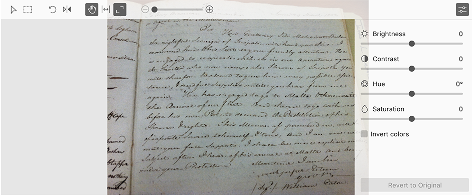

# Edit photos in an item.

Tropy allows you to do basic photo editing. You can do all your photo editing using the toolbar at the top of the photo pane in Item view.

From left to right, the buttons are as follows:

1. Arrow:  This is the basic tool for clicking on your photo. Double-clicking on your photo while the arrow is active will zoom your photo 100%.
2. Select: This tool allows you to make selections that stand on their own. More about [selections](selections.md) here.
3. Rotate: This button rotates your photo counterclockwise by 90 degrees. The keyboard shortcut for this action is Ctrl+space.
4. Mirror: This button flips your photo to its mirror.
5. Pan: Pan allows you to move your photo around while it is zoomed in. You can also activate pan by holding down the space bar.
6. Fit width: This button will fit your photo to the width of the window.
7. Fit window: This button will fit your whole photo into the window.
8. Zoom slider: You can also manually zoom in or out on your photo.

## Advanced photo editing

You can also adjust various settings on your photos to make them more legible. To access the advanced photo editing tools, click on the button on the far right of the photo editing panel. These tools include Brightness, Contrast, Hue, Saturation, and Sharpen.

The _Invert colors_ checkbox allows you to reverse the colors in a negative, such as microfilm.

**Caution**: The _Revert to Original_ button will reset all your photo-editing settings, including rotation and mirroring, not just the sliders.

