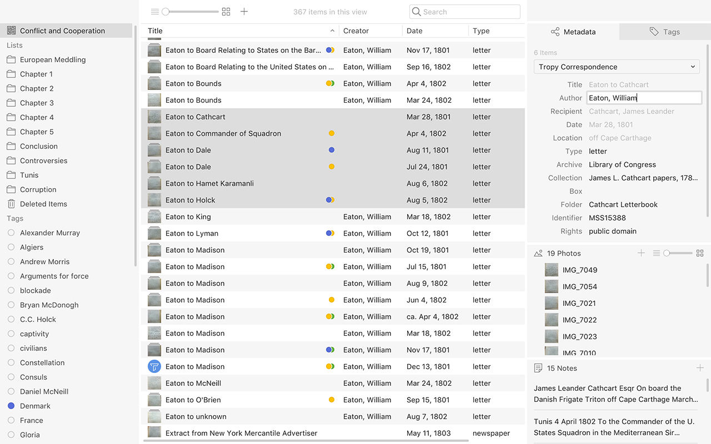

# Add metadata to items.

To describe the content of an item, Tropy uses customizable metadata templates with multiple fields for different properties of the content of your item, for example, title, date, author, box, folder, collection, archive, and rights. Please check out our[ metadata documentation](../before-you-begin/metadata.md) to learn about best practices for creating good metadata.

You can add a new template to your Tropy project to ensure that the metadata you want is in your template. You can also edit an existing template to reorder, add, or subtract fields.

To add or edit metadata to describe your item, click on it to select it. In the metadata pane on the righthand side of the project view, select a template from the pull-down menu. Then you have several options for adding information.

1. Enter your metadata information in the metadata pane on the righthand side of the window. Press Enter to save your information, or press Tab to save your information and move on to the next field.
2. When viewing your items as a list, you can directly edit fields that appear in list columns. Select your item in the item table, and click again on the field you wish to edit. Once you’ve completed your entry, press Enter or Tab to save your information and move on. You can also edit fields by pressing Enter while an item is selected. 
3. Double-clicking on your item in the item table will bring you to the [item view](../in-the-item-view/item-view-basics.md), where you can also edit the metadata, now in the lefthand pane.

#### Adding additional fields to individual items

Generally, all your metadata is entered into a template that can be applied to any item. However, you may find metadata for an item that would likely apply to only that one item. For example, if you work with primarily English-language sources, but one of your sources is translated from another language, you may not want to create a whole new template in order to record the original language in your metadata pane. Instead, you can add an additional field to your item that is not part of the template.

To do this, right-click on the name of the template in the metadata pane. Click on _New Field._ A box will pop up where you can select from any metadata vocabulary term to create your additional field. \(Note that even for additional fields, mapping to an existing metadata schema is required.\) Once you've selected the vocabulary term for your new field, it will appear at the end of your existing metadata template. Notice that the field name is italicized--this is an indication that it is not part of the template.

#### Moving metadata from one field to another

You can move metadata from one field to another by clicking and holding in the metadata field you want to move. Then drag your cursor to the new field and drop.

## Editing metadata in bulk

You can edit the metadata for multiple items at a time.

* Ctrl/Command+click on each item you want to edit; then type your metadata into the metadata pane on the righthand side. 
* To select a large group, press Shift, then select the last item of the group you want to select. The metadata you input will be applied to all items you have selected.
* To select everything in the item table, press Ctrl/Command+A. 

## Photo metadata from image

Digital cameras store information about images they capture in the header of the digital file, using the Exif or IPTC standard. That information usually includes the camera make and models, the camera settings and the date the photograph was taken.

Tropy imports some of that photo metadata and displays it in a metadata template specific to individual photos. The list below is the fields that automatically import; if you wish to add more fields, either from the camera data or from [any other vocabulary](../in-the-template-editor/vocabularies.md), you can [edit or create your own photo template](../in-the-template-editor/edit-templates.md) in [Preferences](../other-features/preferencesmd.md). \(**Note** that in order to automatically populate your photo template with data from your camera, you'll need to set an appropriate template as the default photo template before you import your photos. Fields do not automatically populate if you switch templates once a photo is in Tropy.\)

* file name \(which is editable when you select the photo and then click on it to move to editable mode in the photo pane\)
* date image was taken
* image size in pixels
* file size
* date added to Tropy
* date last modified in Tropy

This information may also be imported directly into your item template if it fits into the metadata schema in your template \(e.g., the file name is imported as Title in most cases\). If you wish to adjust where in your template the filename goes, you can do so in [Preferences](../other-features/preferencesmd.md).

