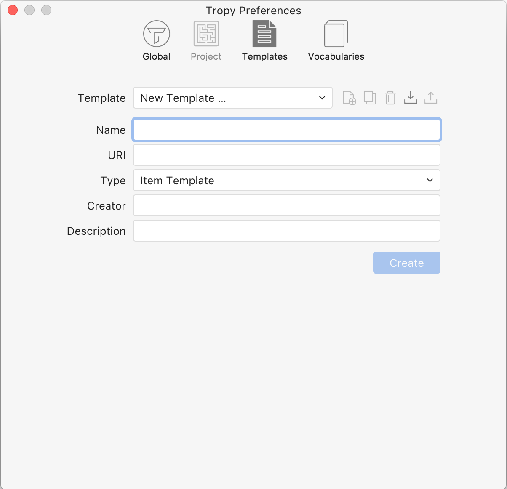

# Getting started with templates

## What are metadata templates?

Metadata templates are forms that you select or create that allow you to record information about your items in ways that are actually useful to you. You can select from the templates that are provided in Tropy, or you can create your own. Before you begin creating your own template, we do recommend that you **browse through the available templates to see if one can be adapted to your needs**; it's easier to add to an existing template than to start from scratch. For an explanation of the templates that ship with Tropy, see [What is metadata and how do I use it?](../before-you-begin/metadata.md)

## Working with the template editor

Access the template editor by navigating to Tropy &gt; Preferences. Click on the Templates icon.

In the drop-down box, you'll see "New Template..." The drop-down is where you can access any templates that are currently loaded into your version of Tropy. The icons to the right of that drop-down represent the first steps toward creating or editing a metadata template. The next several sections of the documentation will walk you through how to use each of those buttons.

