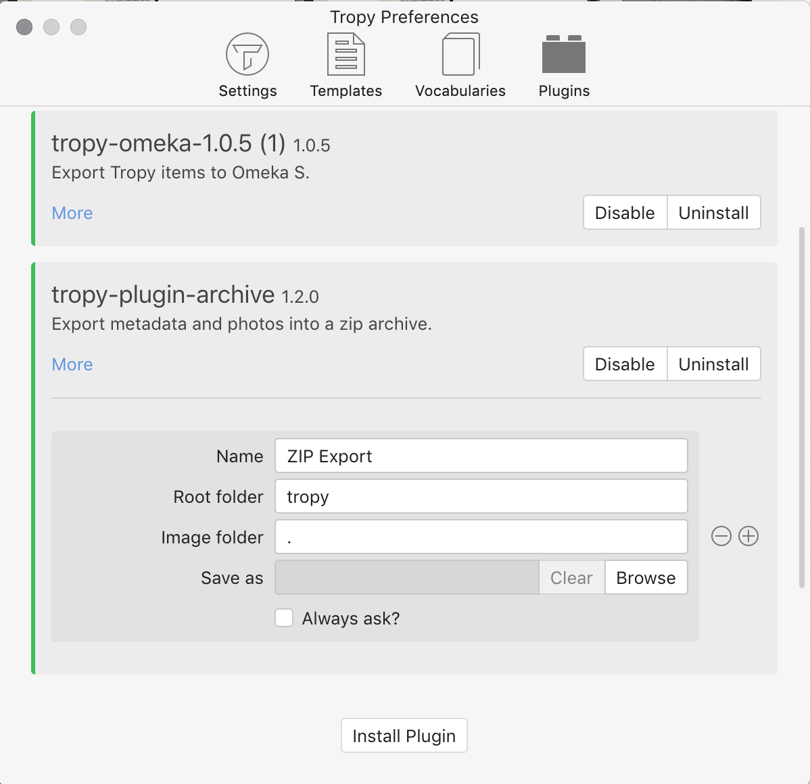
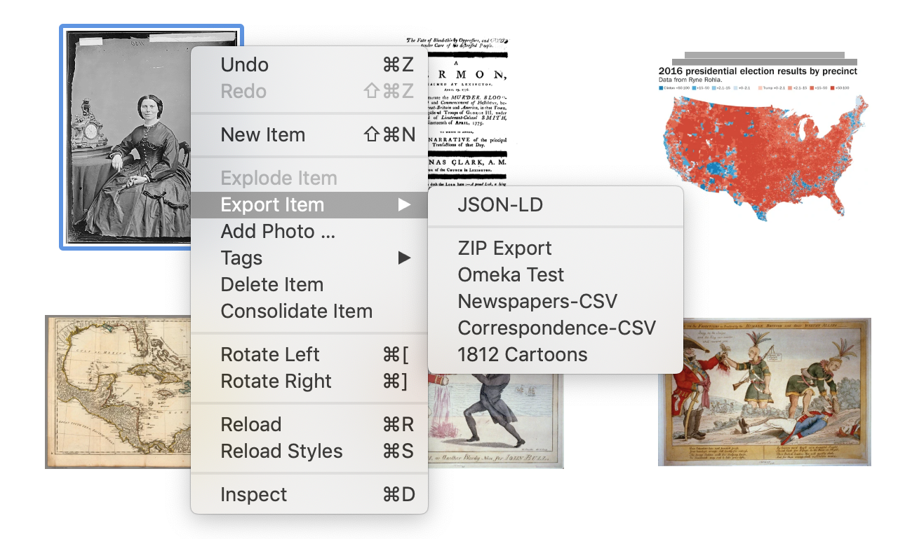

# Export with Archive plugin

The Archive plugin allows you to export items in full--including photos, metadata, and notes--to a ZIP archive. This ZIP archive can then be transferred to another computer or device.

## Getting the Archive plugin

### Download and install the plugin

First, download the latest release [here](https://github.com/tropy/tropy-plugin-archive/releases).

Then navigate to _Preferences &gt; Plugins_. Click on _Install plugin_ and navigate to wherever the ZIP folder saved on your computer. Select the ZIP folder \(don't unzip it\) and click _Open_.

### Activate and customize the plugin

The plugin should now appear in your list of plugins. Click _Enable_ to activate the plugin.

You'll then see a number of options. You can give your plugin a name, if you like \(or you can leave it blank\).

The "Root folder" option tells Tropy what to name the folder inside the ZIP archive which will contain all your exported data. If you want the images to be saved in a folder inside this root folder, separate from the metadata file, you can set the "Image folder" option \(though we do not recommend this for general use\).

The "Save as" option allows you to customize the location and file name for the ZIP archive that will be created. If you select "Always ask?" you will get a dialog box every time you use the plugin in the main Tropy interface that asks you where you'd like to save the ZIP archive and what you'd like to call it.

Once you've set up your preferences, close the Preferences window \(no save necessary\).

## Using the Archive plugin

To export using the archive plugin, select the item or items you want to archive. Right-click on the item\(s\) and navigate to _Export_. Then select the name that you gave the plugin.

If you selected "Always ask?" a dialog box will open and you can select the place you wish to save and the name you wish your folder to have. If you did not, then your ZIP archive will save to the location you set in _Preferences_.
