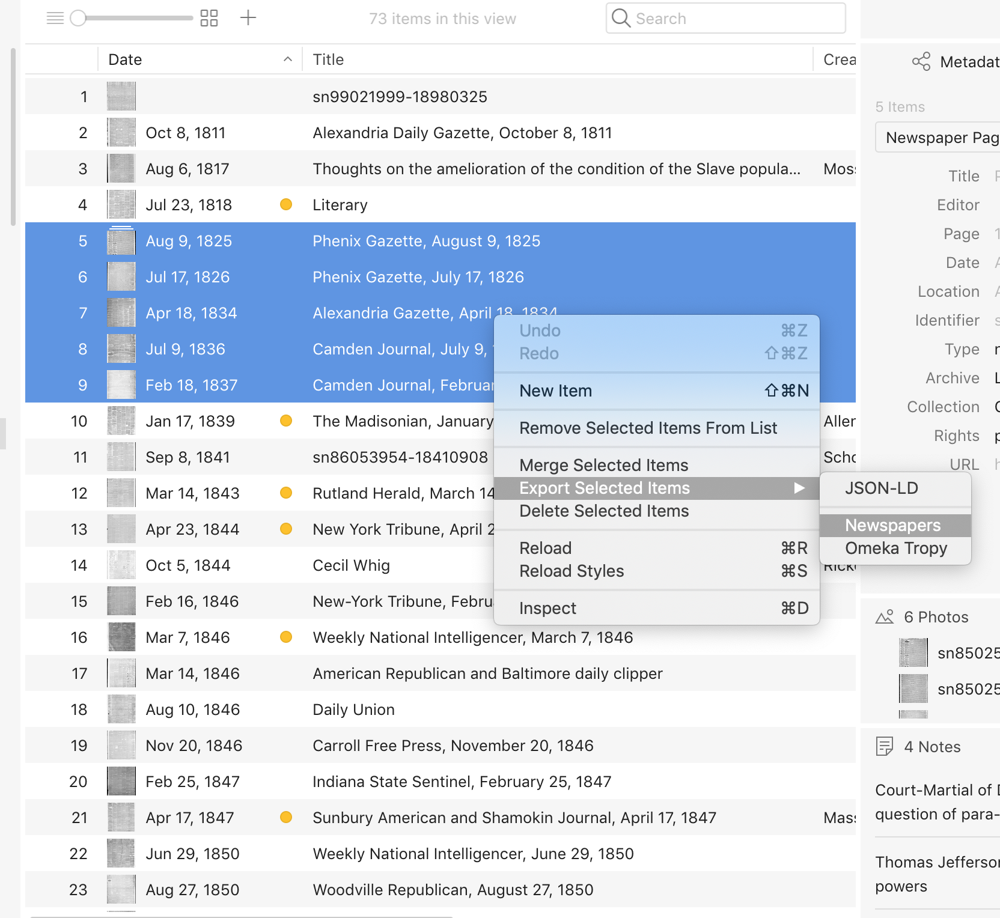
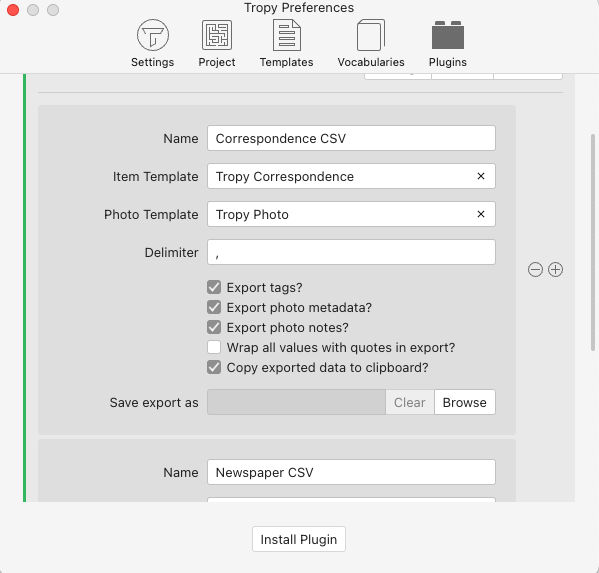

# Export with CSV Export plugin

### Using the CSV Export Plugin

#### 1. Download and install the plugin.

Download the plugin [from GitHub](https://github.com/inukshuk/tropy-plugin-csv/releases/latest). Then, in Tropy, navigate to _Preferences_ &gt; _Plugins_ \(in Windows, _Edit &gt; Preferences &gt; Plugins_\).

Click on _Install Plugin_. In the dialogue box that opens, navigate to wherever you saved the plugin folder from GitHub; select it, then click _Open_. You have now installed the CSV Export plugin.

#### 2. Activate and customize the plugin.

First, click _Enable_ next to the plugin's name.

Then click on the name of the plugin to open up a customization panel within the Plugins pane.

You will see there several options for customization. You can change the name of your plugin instance if you wish. Then check the boxes for the options you want.

The field labeled Template tells Tropy exactly which fields you want to include in the CSV export. If you are exporting items that all use the same custom template, you should [find the URI](../in-the-template-editor/using-templates.md) of that custom template and paste it into the Template field here. That ensures that all the fields are exported and in the order you expect.

If you're exporting multiple items that use multiple templates, you'll want to create a new template in the [template editor](../in-the-template-editor/create-template.md) that includes all the fields you want in your export. Then paste the URI of that template into the Template field here in Plugins.

You can also set the default file name of the export \(though this can be changed when you're using the plugin\).

#### 3. Use the plugin to export items.

Once you have customized the plugin, close the Preferences window \(there's no Save button---your settings autosave\).

In your item table, right-click on the item you wish to export, or select multiple items and then right-click. Navigate to _Export Selected Items_ and click on the name of the CSV Export plugin \(remember that you might have given it a different name in the Plugins customization window\).

A dialog box will open. Select where you want to save your exported CSV and change the name of the file if you wish. Then click _Save_.

#### 4. Look at your CSV in another application.

Your CSV should be complete! If you look at the CSV in another application, you'll notice that the header row is the URIs of the fields in your chosen metadata template. Tropy exports using the URIs because it's possible that you have multiple labels for the same property across various templates.

#### Notes

If you anticipate exporting items in specific different categories often \(e.g., newspapers and correspondence\), you may wish to have two separate instances of the plugin so you don't have to switch back and forth between your Newspaper template and your Correspondence template in the Plugin settings. To add another instance, click on the plus sign next to the first plugin instance to add another instance and customize it as you wish \(without deleting the first instance\). Be sure you name it something different!

