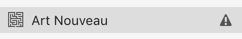

# Reporting problems

### Detecting problems

If your database has been corrupted in some way, you should see a flag next to your project name. 

### Reporting problems

Tropy maintains [support forums](https://forums.tropy.org/) where you can ask questions, suggest additional features, and see what others are saying about Tropy.

If you have questions or suggestions for making this documentation more useful, please [write us a note on the forums](https://forums.tropy.org/)!

