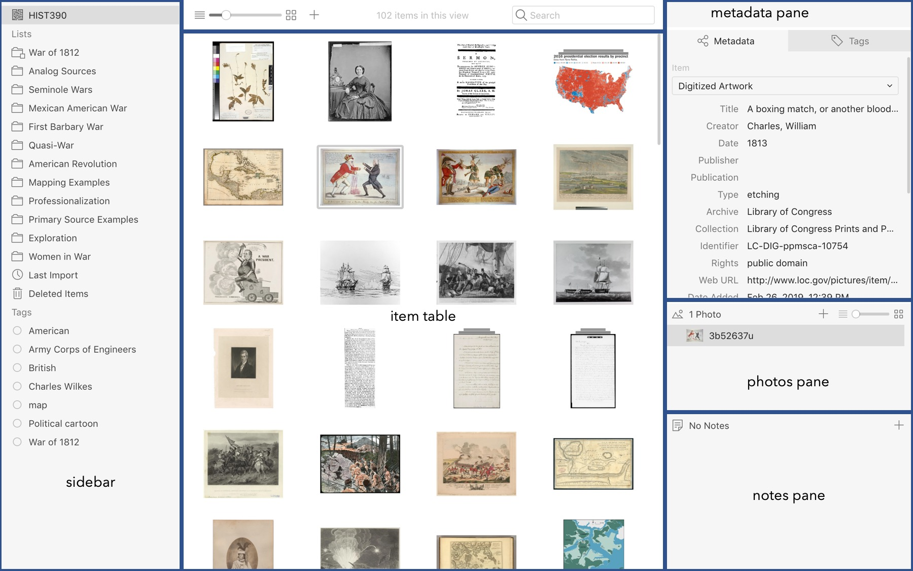
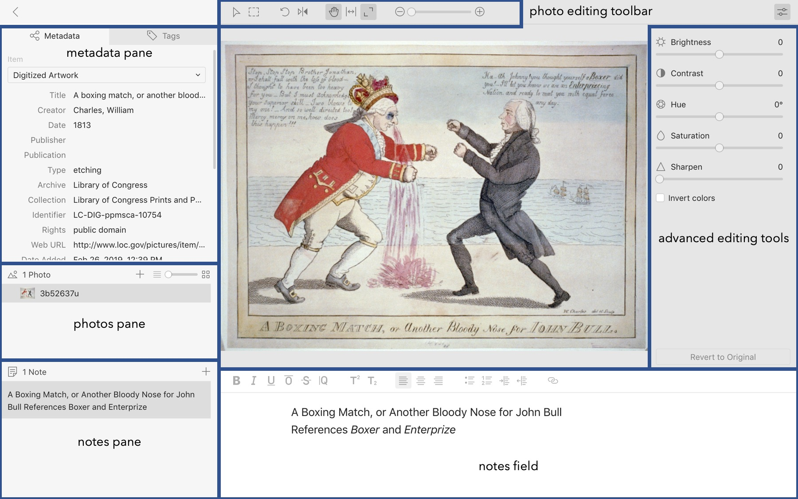

# Intro to the interface

Tropy's interface is designed to be as user-friendly and straightforward as possible. There are two main views: the project view and the item view.

### Project view

To collapse or expand any of the panes on the right, double-click in their headers. For more information about how to use the tools in this view, see [View photos in project view](../in-the-project-view/view_photos.md) and the following pages.

### Item view

In item view, you can also collapse or expand the metadata, photos, or notes pane by double-clicking in their headers. To collapse or expand the advanced photo editing tools, click on the icon in the top right. For more about how to use the item view, see [Getting started in the item view](../in-the-item-view/item-view-basics.md).

